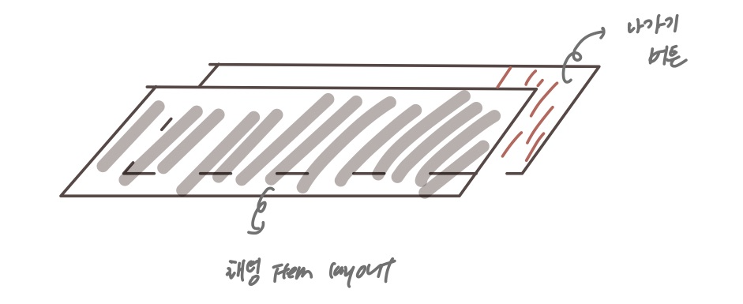
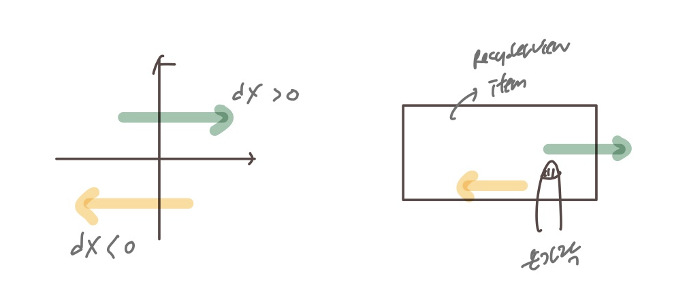

# ItemDecoration

## ItemTouchHelper

- RecyclerView item에 대해 swipe/drag를 위한 유용한 클래스
- override method
    - `ItemTouchHelper.Callback.onMove(RecyclerView, ViewHolder, ViewHolder)`
    - `ItemTouchHelper.Callback.onSwiped(ViewHolder, int)`
- 특정한 상황들을 위한 디자인 custom 가능
    - `ItemTouchHelper.Callback` 클래스 메서드 상속
    - `ItemTouchHelper.ViewDropHandler` 인터페이스 구현
- item의 translate X/Y 속성 이용해 custom 가능
    - `ItemTouchHelper.Callback.onChildDraw(Canvas, RecyclerView, ViewHolder, float, float, int, boolean)`
    - `ItemTouchHelper.Callback.onChildDrawOver(Canvas, RecyclerView, ViewHolder, float, float, int, boolean)`
    

### # methods

- **onDraw**
    - item view가 그려지기 전에 내용물이 그려짐
    - item view 아래에 그려지게 됨
- **onDrawOver**
    - item view가 그려진 이후 내용물이 그려짐
    - item view 위에 그려지게 됨
    

---

## ItemTouchHelper.Callback

<aside>
💡 This class is the contract between ItemTouchHelper and your application. It lets you control which touch behaviors are enabled per each ViewHolder and also receive callbacks when user performs these actions.

</aside>

⇒ 사용자가 action을 수행할 경우, 해당 action에 대한 callback을 받을 수 있는 클래스

- `getMovementFlags(RecyclerView, ViewHolder)`
    - 각각의 View에 사용자의 action을 통제하기 위해 override 필요한 메서드
    - 적절한 방향 flags들 return 필요
    - `makeMovementFlags(int, int)` 통해 쉽게 작성 가능

- `onSwiped(ViewHolder, int)`
    - view가 swipe 될 경우 호출하는 메서드
    
- `getDefaultUIUtil()`
    - 사용자의 interaction에 반응하여 visual change에 사용되는 `ItemTouchUIUtil` 을 반환하는 메서드
    - 특정 뷰를 이동시킬 때 사용할 수 있음
    
- `clearView(RecyclerView,RecyclerView.ViewHolder)`
    - 사용자와 상호작용이 끝나거나, 애니메이션이 끝나면 호출
    - 모든 변화를 clear 할 때 사용됨
    

#

### ItemTouchHelper 통한 Swipe 구현



위의 사진과 같이 RecyclerView의 item을 swipe 할 경우, 

맨 위의 view만 이동시켜 하위 view가 보여지도록 구현할 것이다 (하위 view는 움직이면 안된다.)    
#

공식문서 예제 코드

```java
public void clearView(RecyclerView recyclerView, RecyclerView.ViewHolder viewHolder){
         getDefaultUIUtil().clearView(((ItemTouchViewHolder) viewHolder).textView);
     }
     public void onSelectedChanged(RecyclerView.ViewHolder viewHolder, int actionState) {
         if (viewHolder != null){
             getDefaultUIUtil().onSelected(((ItemTouchViewHolder) viewHolder).textView);
         }
     }
     public void onChildDraw(Canvas c, RecyclerView recyclerView,
             RecyclerView.ViewHolder viewHolder, float dX, float dY, int actionState,
             boolean isCurrentlyActive) {
         getDefaultUIUtil().onDraw(c, recyclerView,
                 ((ItemTouchViewHolder) viewHolder).textView, dX, dY,
                 actionState, isCurrentlyActive);
         return true;
     }
```

generate을 통해 자동으로 onChildDraw() 메서드를 override 하게 되면, 

```java
super.onChildDraw(c, recyclerView, viewHolder, dX, dY, actionState, isCurrentlyActive);
```

코드가 작성되게 된다. 

해당 코드를 그대로 두게 될 경우, 내가 의도한 swipe 시킬 view만 움직이게 되는 것이 아닌, 뒤의 view도 앞에 놓인 view를 따라 같이 swipe되게 된다. 


위의 코드를 제거해야 아래 사진과 같이 내가 원하던 view만 swipe가 가능해진다.


추가로, onChildDraw()의 매개변수를 살펴보면 dX, dY가 있다. 

dX 값이 양수인지 음수인지를 구분할 경우(방향에 따라 결정됨), 왼쪽과 오른쪽 각각에 원하는 custom이 가능해진다. 

이때 dX의 부호 판단은 아래 그림과 같이 하면 된다. 



내가 앱을 사용하면서 RecyclerView의 item을 swipe 한다고 가정할 때, 나의 손가락이 y축이 된다고 생각하면 된다. 

내 손가락을 기준으로 왼쪽으로 가면 음의 부호를, 오른쪽으로 가면 양의 부호를 띄게 된다. 

#
@ 참고

[https://velog.io/@trycatch98/Android-RecyclerView-Swipe-Menu](https://velog.io/@trycatch98/Android-RecyclerView-Swipe-Menu)
