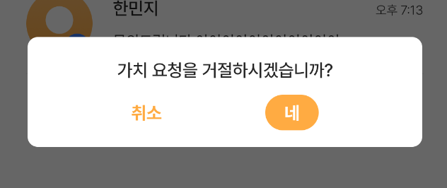
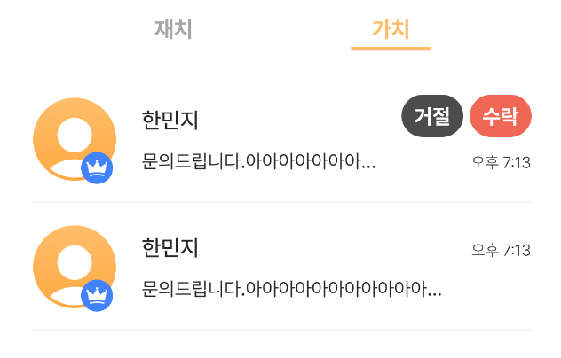
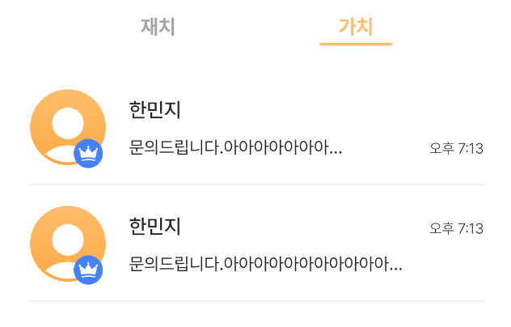

# 2022.03.07

## AlertDialog 코드 정리

어제와 비슷한 경우인데, Zatch 프로젝트를 보면 Alert dialog를 띄우는 경우가 되게 많다. 

게다가 Alert dialog에 대해서 custom을 진행하였기 때문에 코드로 작성할 경우, 설정값이 많다보니 길이가 길어서 매번 구현하기 좀 번거로웠었다. 

클래스를 작성해 dialog에서 사용되는 view들을 관리할 수 있도록 해야겠다는 생각을 하게 되었다.  

현재 프로젝트에서 사용하고 있는 Alert Dialog 종류가 3가지인데, 

이 중 가장 코드가 길고 많이 사용되는 positive_negative_dialog를 먼저 정리했다. 

 

```java
public class PositiveNegativeDialog {

    private View view;
    private AlertDialog.Builder builder;
    private AlertDialog dialog;
    private TextView negative, positive, message;
    private PNDialogMessage dialogData;

    public PositiveNegativeDialog(Context context, ServiceType type, PNDialogMessage dialogData) {
        this.dialogData = dialogData;
        this.builder = new AlertDialog.Builder(context);
        if(type == ServiceType.Zatch)
            this.view = LayoutInflater.from(context).inflate(R.layout.dialog_negative_positive,null);
        else
            this.view = LayoutInflater.from(context).inflate(R.layout.dialog_negative_positive_yellow,null);
    }

    private void setViewComponent(){
        this.negative = view.findViewById(R.id.dialogNegativeButton);
        this.positive = view.findViewById(R.id.dialogPositiveButton);
        positive.setText(dialogData.getPositive());
        this.message = view.findViewById(R.id.dialogAskMessage);
        message.setText(dialogData.getMessage());
    }

    public AlertDialog createDialog(){
        builder.setView(this.view);
        setViewComponent();
        this.dialog = builder.create();
        dialog.getWindow().setBackgroundDrawable(new ColorDrawable(Color.TRANSPARENT));
        return dialog;
    }
    
    public void setMessageText(String newMessage){
        this.message.setText(newMessage);
    }

    public TextView getNegative() {
        return negative;
    }

    public TextView getPositive() {
        return positive;
    }

    public String getMessageText(){
        return message.getText().toString();
    }
    
}
```

<aside>

    💡 > 생성자의 경우, Alert Dialog를 띄우기 위해 필요한 최소한의 정보만 초기화 되도록 작성해봤다.

    → view 초기화 정보를 생성자 안에 넣어야 하나 고민을 했지만, 생성자가 너무 무거워지지 않을까 싶어서 객체를 생성하고 이후 dialog를 생성할 때 view에 대한 초기화 작업이 진행되도록 했다. 

    > positive_negative dialog의 경우, positive 버튼, negative 버튼 각각을 눌렀을 때 처리해야 하는 작업, 일어나야 하는 행동등이 있기 때문에 dialog 생성시 생성한 객체를 반환하는 함수를 작성했다.

</aside>

---

```java
public enum PNDialogMessage {

    GatchAccept("가치 채팅방으로 이동합니다.", "네"),
    GatchRefuse("가치 요청을 거절하시겠습니까?", "네"),
    Exit("채팅방을 나가시겠습니까?\n" +
            "채팅방을 나가면 채팅 내역은 복구되지 않습니다.", "네, 확인했습니다."),
    MakeMeeting("약속을 등록하시겠습니까?", "확인"),
    Block("님을 차단하시겠습니까?\n더 이상의 대화가 불가합니다.","네, 차단합니다."),
    Register("등록을 완료하시겠습니까?","등록 완료");

    private final String message;
    private final String positive;

    PNDialogMessage(String message, String positive) {
        this.message = message;
        this.positive = positive;
    }

    public String getMessage(){
        return this.message;
    }

    public String getPositive(){
        return this.positive;
    }
}
```

`PNDialogMessage` 은 Alert Dialog의 message와 postitive 버튼 text로 넣을 데이터를 가지고 있다.   

이는 생성자를 생성시, 인자로 넣어줘야 하는 데이터 중 하나이다. 

<aside>
💡  > `enum` 타입을 사용하고 있는데, 클래스로 작성해야 하나, 열거형으로 작성해야 하나 고민을 했었다. 

→ 클래스로 작성하게 될 경우, 객체를 생성할 때마다 어떤 메시지를 넣어줄 지도 매번 인자로 넣어줘야 한다. 

1. 앞에 재치가 붙냐, 가치가 붙냐만 다를 뿐, 재치와 가치에서 같은 안내 메시지를 출력하는 경우가 많다.
2. 같은 메시지를 재사용하는 경우도 많다

이러한 2가지 이유 때문에 매번 값을 직접 지정해서 넣어줘야 하는 클래스 보다는 미리 지정된 값을 넘겨주는 열거형으로 구현을 하는 것이 더 좋다고 생각했다.

</aside>

---

```java
PositiveNegativeDialog dialogClass = new PositiveNegativeDialog(getContext(), ServiceType.Zatch, PNDialogMessage.MakeMeeting);        
AlertDialog dialog = dialogClass.createDialog();        
dialogClass.getNegative().setOnClickListener(v->{       
	dialog.dismiss();        
});       
dialogClass.getPositive().setOnClickListener(v->{            
	listener.finishBottomSheet(true);            
	dialog.dismiss();        
});       
dialog.show();
```

정리한 클래스로 작성한 코드이다. 

```java
builder = new AlertDialog.Builder(getContext());
View view = LayoutInflater.from(getContext()).inflate(R.layout.dialog_negative_positive,null);
builder.setView(view);
TextView positive = view.findViewById(R.id.dialogPositiveButton);
TextView negative = view.findViewById(R.id.dialogNegativeButton);
TextView text = view.findViewById(R.id.dialogAskMessage);
text.setText("");
positive.setText("확인");
dialog = builder.create();
dialog.getWindow().setBackgroundDrawable(new ColorDrawable(Color.TRANSPARENT));
positive.setOnClickListener(v -> {
    dialog.dismiss();
    listener.finishBottomSheet(true);
    dismiss();
});
negative.setOnClickListener(v -> {
    dialog.dismiss();
});
dialog.show();
```

이건 원래 코드.

2가지로 놓고 비교해보면, 훨씬 간편하다는 것을 느낄 수 있다. 

남은 Alert Dialog들도 조만간 정리를 진행할 듯 하다. 

<aside>

    💡 오늘 위의 클래스를 작성하면서 들었던 생각은 `interface` 를 활용할 수도 있지 않을까? 라는 생각이다. 

    → `setViewComponent()` 와 `createDialog()` 는 공통적으로 사용될 메서드라고 생각했기 때문.
    (추가로, `getPositive()` 정도..?)

</aside>

남은 Alert Dialog를 정리하면서 interface를 고려해서 다시 설계하고 구현해보도록 해야겠다.

---

## RecyclerView Item




Alert Dialog에서 “네”를 선택하면, item이 삭제되도록 구현했다. 





왼쪽이 문제 발생 상황, 오른쪽이 정상적으로 동작 상황

<aside>

    💥  RecyclerView에서 특정 item을 data 세트에서 제거한 후, `notifyDataSetChanged()` 을 호출하면, 내가 누른 item이 아닌, 다른 item이 삭제되는 문제 발생

    (정확히는 다른 item이 삭제되는게 아니라, 이상한 item이 삭제된 것 처럼 보이는 것...)

</aside>

```java
public void setData(GatchJoinState data){            
	this.joinState = data;                       
	if(data == GatchJoinState.Admin) {               
			acceptLayout.setVisibility(View.VISIBLE);               
			changeAdminLayout();            
		}        
}
```

기존 코드

```java
public void setData(GatchJoinState data){            
	this.joinState = data;  
	acceptLayout.setVisibility(View.INVISIBLE);  //추가한 부분                
	if(data == GatchJoinState.Admin) {               
			acceptLayout.setVisibility(View.VISIBLE);               
			changeAdminLayout();            
		}        
}
```

수정 코드 

<aside>

    ❗  > RecyclerView의 itemView를 초기화해주지 않았기 때문에 발생한 문제이다. 

    → 매번 프로젝트를 할 때마다, 색상등 때문에 item에 오류가 발생하는데 결국은 모두 itemView 초기화 문제였다. 

    현재 위의 수정코드에는 급한 것인 거절/수락 레이아웃의 visibility만 초기화를 시켜놨는데, 나중에 data binding 작업을 할 때 각 view에 대해서 잊지 말고 꼭 초기화 함수 구현하도록 하자.

</aside>

---

## View LayoutParam 수정

1. 원래 상황


수락 버튼을 클릭시, message와 time view의 레이아웃 제약 조건을 변경할 것이다. 

1. 처음 시도한 코드

```java
ConstraintLayout.LayoutParams timeParams = new ConstraintLayout.LayoutParams(time.getLayoutParams());
```


위의 사진과 같이, 레이아웃 제약이 망가진 것을 볼 수 있다. 

1. 이후 수정한 코드

```java
ConstraintLayout.LayoutParams timeParams = (ConstraintLayout.LayoutParams) time.getLayoutParams();    
```


정상적으로 기존 레이아웃을 유지하면서, 필요한 제약조건만 수정되었다.

<aside>

    💡 기존 레이아웃 제약에 대해 수정할 경우, 새로운 제약을 생성하는 것이 아닌, 기존 제약을 불러와야 함

    > new ConstraintLayout.LayoutParams()를 작성했을 때, 이 생성자 안에 time의 레이아웃 params를 불러다가 넣어주는 것이기 때문에, 기존 레이아웃은 유지하고 원하는 부분만 수정이 진행될 것이라 생각했다.

    하지만 아니다. 결국은 새로운 생성자를 생성해주는 것이기 때문인 듯 하다.

    ❗ 기존 레이아웃 수정하고 싶으면, 기존 레이아웃 params 불러다가 새로운 변수에 할당하자.

</aside>

```java
private void changeAccessLayout(){
                       
	acceptLayout.setVisibility(View.GONE);
           
	ConstraintLayout.LayoutParams timeParams = (ConstraintLayout.LayoutParams) time.getLayoutParams();            
	timeParams.baselineToBaseline = name.getId();           
	time.setLayoutParams(timeParams);
           
	ConstraintLayout.LayoutParams messageParams = (ConstraintLayout.LayoutParams) message.getLayoutParams();           
	messageParams.endToStart = time.getId();          
	messageParams.rightMargin = (int) new ReturnPx(18,context).returnPx();            
	message.setLayoutParams(messageParams);        
}
```

위의 상황에 대한 코드이다.