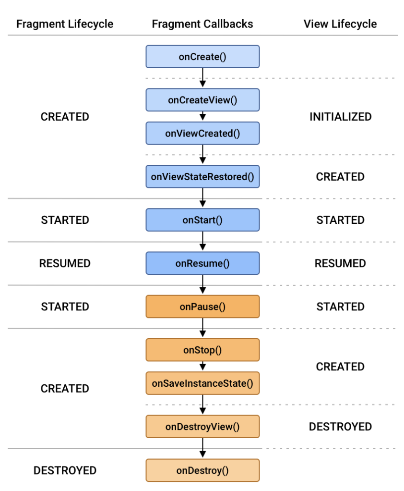

# 2022.03.08

## onViewCreated(View, Bundle)

<aside>
    
    👉🏻 Called immediately after `onCreateView(android.view.LayoutInflater, android.view.ViewGroup, android.os.Bundle)` has returned, but before any saved state has been restored in to the view. This gives subclasses a chance to initialize themselves once they know their view hierarchy has been completely created. The fragment's view hierarchy is not however attached to its parent at this point.

</aside>

<aside>

    👉🏻 `Bundle`
    : If non-null, this fragment is being re-constructed from a previous saved state as given here.

</aside>

```java
public void onViewCreated(@NonNull View view, Bundle savedInstanceState) {
        super.onViewCreated(view, savedInstanceState);

        view.findViewById(R.id.button_first).setOnClickListener(new View.OnClickListener() {
            @Override
            public void onClick(View view) {
                NavHostFragment.findNavController(FirstFragment.this)
                        .navigate(R.id.action_FirstFragment_to_SecondFragment);
            }
        });
    }
```

공식 문서 예제 코드


```java
	private View view;

    public View onCreateView(@NonNull LayoutInflater inflater, ViewGroup container, Bundle savedInstanceState) {

        view = inflater.inflate(R.layout.fragment_chat, container, false);

        zatchTab = view.findViewById(R.id.zatchChatTab);
        gatchTab = view.findViewById(R.id.gatchChatTab);
        textLine = view.findViewById(R.id.textBottomLine);
        params = (ConstraintLayout.LayoutParams) textLine.getLayoutParams();

        zatchTab.setOnClickListener(onClickListener);
        gatchTab.setOnClickListener(onClickListener);

        zatchTab.setChecked(true);
        gatchTab.setChecked(false);

        return view;
    }
```
기존에 내가 작성한 코드
#
```java
@Override
    public void onViewCreated(@NonNull View view, @Nullable Bundle savedInstanceState) {

        zatchTab = view.findViewById(R.id.zatchChatTab);
        gatchTab = view.findViewById(R.id.gatchChatTab);
        textLine = view.findViewById(R.id.textBottomLine);
        params = (ConstraintLayout.LayoutParams) textLine.getLayoutParams();

        zatchTab.setOnClickListener(onClickListener);
        gatchTab.setOnClickListener(onClickListener);

        //초기화
        zatchTab.setChecked(true);
        gatchTab.setChecked(false);
    }
```

수정한 코드
#
<aside>

    💡 > 그동안 `onCreateView()` 메서드를 override해 이 안에서 초기화되도록 코드를 작성했다.

    → 안드로이드 스튜디오에서 제공하는 기본적인 activity 코드를 참고해 보니, view 초기화를 `onViewCreated()` 에서 진행하고 있었다. 
    
    → `onViewCreated()` 메서드는 그동안 고려하지 못했던 부분이라 공식문서를 찾아보았다.

</aside>

#


<aside>

    💡 → `onCreateView()`에서 view가 초기화중이기 때문에 충돌이 일어날 수 있다.

    ❗`onCreateView()`에서는 레이아웃 inflate만 진행하고, `findViewById` 통한 view 초기화는 `onViewCreated()` 에서 진행해야 한다.

    ❗ 여기서 추가로 살펴봐야 할 점은, Fragment와 View의 생명주기가 다르다는 것이다.

</aside>

@ 참고 [https://ddangeun.tistory.com/50](https://ddangeun.tistory.com/50)

---

## getSwipeThreshold(ViewHolder)

<aside>

    👉🏻 Returns the fraction that the user should move the View to be considered as swiped. The fraction is calculated with respect to RecyclerView's bounds.

    → swipe로 간주한다는 것에 대해서 나는 Swipe가 취소되는(원 상태로 돌아가는) 것만 아니면 swipe로 간주되는 것이라고 생각을 했었다.

    ❗ 문서에서 의미하는 것은 전체로 다 넘어가는 것을 swipe로 간주하는 것이었다.

</aside>

#


`getSwipeThreshold()`  에 return 값에 따른 swipe 정도의 차이를 살펴보도록 하겠다.

1. 0.3f
2. 0.7f 
→ 0.3f와 마찬가지로 화면의 30%비율만 끌어도 전체 다 넘어가게 된다. 


#

3. 1f 
→ 가능하긴 함. 하지만 화면 왼쪽 끝부터 오른쪽 끝까지 끌지 않는 이상 불가능 하다.


#
4. 1.4f 
→ 1f를 넘어가게 되면, RecyclerView width를 넘는 것이므로, 전체를 넘어갈 수가 없음. 


#
```swift
@Override
    public float getSwipeThreshold(@NonNull RecyclerView.ViewHolder viewHolder) {
        if(viewHolder instanceof ZatchChatListAdapter.ViewHolder)
            if(((ZatchChatListAdapter.ViewHolder) viewHolder).getInfoViewVisibility())
                return 0.4f;
        boolean isClamp = getTag(viewHolder);
        setTag(viewHolder, !isClamp && currentDx <= -exitWidth );
        return 2f;
    }
```

<aside>

    💡 > swipe 정도를 설정할 수 있는 것은 getSwipeThreshold()이다.

    → 해당 함수에서는 dX 값을 제공하지 않기 때문에, 다른 방식으로 swipe 방향을 인식해야 한다.

    → viewHolder를 통해 view를 가져와, visibility를 점검하고 방향을 인식하도록 구현했다.

    왼쪽은 전체 view가 다 넘어가야 하는 상황, 오른쪽은 전체 view가 넘어가면 안되는 상황

    → 각각의 상황에 맞는 값을 반환하도록 구현. 

    ❗getSwipeThreshold() 메서드내에서 viewHolder를 잘 활용하면, 경우에 따라 다르게 swipe 정도를 설정할 수 있다.

</aside>
