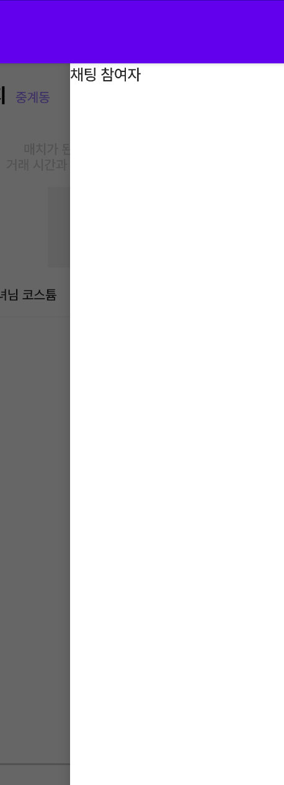
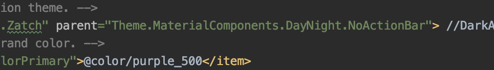

# 2022.03.11

## DrawerLayout

- Drawer = 서랍
- 고정되는 레이아웃이 아닌, 버튼 또는 스와이프를 통해 레이아웃이 보여지거나, 사라지게 하는 레이아웃
- `android:layout_gravity` 이용해 drawer 위치 설정

```xml
<?xml version="1.0" encoding="utf-8"?>
<androidx.drawerlayout.widget.DrawerLayout xmlns:android="http://schemas.android.com/apk/res/android"
    xmlns:app="http://schemas.android.com/apk/res-auto"
    xmlns:tools="http://schemas.android.com/tools"
    android:id="@+id/drawer_zatch"
    android:layout_width="match_parent"
    android:layout_height="match_parent"
    android:fitsSystemWindows="true"
    tools:openDrawer="end">

    <include
        layout="@layout/activity_zatch_chatting_room"
        android:layout_width="match_parent"
        android:layout_height="match_parent" />

    <androidx.constraintlayout.widget.ConstraintLayout
        android:id="@+id/drawer_list"
        android:background="@color/white"
        android:layout_width="match_parent"
        android:layout_marginLeft="100dp"
        android:layout_height="match_parent"
        android:layout_gravity="right"
        android:fitsSystemWindows="true">

        <TextView
            android:layout_width="wrap_content"
            android:layout_height="wrap_content"
            android:text="채팅 참여자"/>
    </androidx.constraintlayout.widget.ConstraintLayout>

</androidx.drawerlayout.widget.DrawerLayout>
```

```java
		private DrawerLayout memberFragment;

		@Override
    protected void onCreate(@Nullable Bundle savedInstanceState) {

        super.onCreate(savedInstanceState);
        setContentView(R.layout.drawer_layout_chatting_room_zatch);
        memberFragment = findViewById(R.id.drawer_zatch);

    }
```

<aside>

    💡  > DrawerLayout 변수를 선언할 때, 가장 바깥에 호출한 
    DrawerLayout id(drawer_zatch)를 가져와야 함.

    →  drawer로 사용될 레이아웃이 Constraint가 아닌 Drawer일 경우에 헷갈리지 말기.

</aside>

```java
View.OnClickListener onClickListener = new View.OnClickListener() {
        @Override
        public void onClick(View v) {
            switch (v.getId()){
                case R.id.roomEtcButton:
                    memberFragment.openDrawer(Gravity.RIGHT);
                    break;
            }
        }
    };
```

<aside>
    
    💡  > roomEtcButton 통해 drawer layout인 채팅 멤버 리스트 사이드 창 open 시킴

</aside>

---


<aside>

    💥  DrawerLayout을 사용할 때, activity class에서 actionBar를 hide 시켰지만, actionBar가 보이는 문제 발생

</aside>


<aside>

    💡 > 어차피 해당 앱에서 ActionBar를 사용하는 경우가 없기 때문에, 아예 없애는 방법 선택

    →  NoActionBar는 해당 프로젝트에서 actionBar 자체를 사용하지 않겠다는 뜻이다.

</aside>