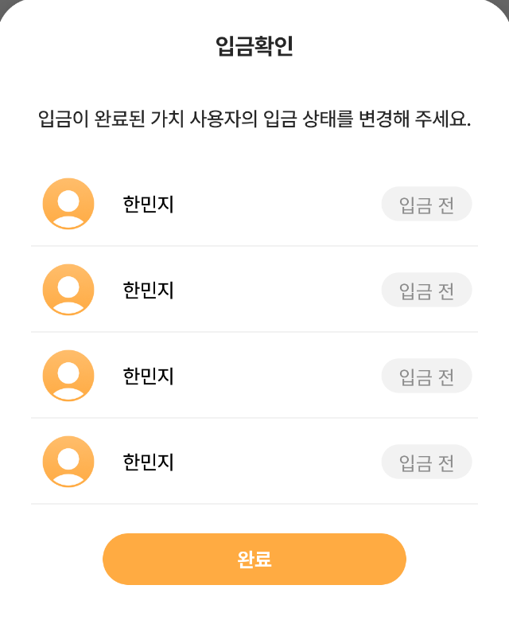
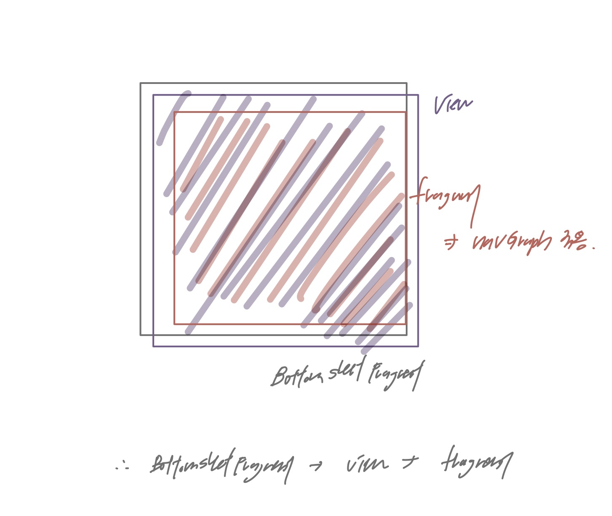

# 2022.03.14

## ViewHoler Binding

```java
    public class DepositCheckAdapter extends RecyclerView.Adapter<DepositCheckAdapter.ViewHolder> {

        private String[] memberData;
//        private ItemOwnerDepositCheckBinding binding; -> error 발생 

        public class ViewHolder extends RecyclerView.ViewHolder {

            private ItemOwnerDepositCheckBinding binding;

            public ViewHolder(View view) {
                super(view);
                binding = ItemOwnerDepositCheckBinding.bind(view);
                binding.checkDepositState.setOnCheckedChangeListener((buttonView, isChecked) -> {
                    String state = isChecked ? "입금 후" : "입금 전";
                    binding.checkDepositState.setText(state);
               });
            }

            public void setData(String data){
            }
        }
}
```

<aside>

    💡  > binding 변수 위치

    → Recyclerview에서 각 viewHolder 별로 다른 데이터가 적용되어야 함

    → viewHolder 별로 binding 세팅 필요함

    → ViewHolder 클래스 내 변수로 선언(Adapter 변수로 선언하면X)

    ❗ if adapter내 변수로 선언하면, 마지막으로 생성된 vieholder의 binding의 정보가 binding 변수에 할당되어, recyclerview item에 클릭 이벤트를 넣어도 마지막 viewHolder에 대해서 동작하게 됨

</aside>

---

# Navigation

- NavController 객체를 사용해 대상으로 이동 가능
- NavController는 NavHost 내에서 앱 탐색 관리
- 각 NavHost마다 NavController 존재

## NavController 가져오기

- `NavHostFragment.findNavController(Fragment)`
- `Navigation.findNavController(Activity, @IdRes int viewId)`
    
    <aside>
        
        👉🏻 Find a `NavController` given the id of a View and its containing `Activity`. This is a convenience wrapper around `findNavController`.
    
        This method will locate the `NavController` associated with this view. This is automatically populated for the id of a `NavHost` and its children.
    
    </aside>
    
- `Navigation.findNavController(View)`
    
    <aside>
    
        👉🏻 Find a `NavController` given a local `View`.
    
        This method will locate the `NavController` associated with this view. This is automatically populated for views that are managed by a `NavHost` and is intended for use by various `listener` interfaces.
    
    </aside>
    
- NavController를 가져온 후, navigate()를 통해 대상 사이 이동 가능

---

💡 상황에 따른 메서드 사용

1. **NavHostFragment.findNavController(Fragment)**

- 예시 상황
    
    
    bottom_sheet_deposit.xml은 deposit 관련해서 재사용되는 bottom sheet xml파일
    
    fragment를 child view로 넣어 해당 부분에서 필요한 frament로 바꿔나가는 상황
    
    이때, navGraph를 상황에 따라 설정해주기 위해 Navigation 메서드인 setGraph()사용할 예정
    
    ```xml
    //bottom_sheet_deposit.xml
    <?xml version="1.0" encoding="utf-8"?>
    <androidx.constraintlayout.widget.ConstraintLayout
        xmlns:android="http://schemas.android.com/apk/res/android"
        xmlns:app="http://schemas.android.com/apk/res-auto"
        xmlns:tools="http://schemas.android.com/tools"
        android:layout_width="match_parent"
        android:layout_height="match_parent">
    
        <fragment
            android:id="@+id/depositFragment"
            android:name="androidx.navigation.fragment.NavHostFragment"
            android:layout_width="match_parent"
            android:layout_height="wrap_content"
            app:defaultNavHost="true"
            app:navGraph="@navigation/navigation_deposit_bottom_sheet"/>
    </androidx.constraintlayout.widget.ConstraintLayout>
    ```
    
    
    
    
    
    ```java
    public class DepositBottomSheet extends BottomSheetDialogFragment{
    
        private BottomSheetDepositBinding binding;
    
        @Nullable
        @Override
        public View onCreateView(@NonNull LayoutInflater inflater, @Nullable ViewGroup container, @Nullable Bundle savedInstanceState) {
            binding = BottomSheetDepositBinding.inflate(inflater,container,false);
            View view = binding.getRoot();
            return view;
        }
    
        @Override
        public void onViewCreated(@NonNull View view, @Nullable Bundle savedInstanceState) {
            if(!isDepositInfoRegister)
                NavHostFragment.findNavController(getChildFragmentManager().findFragmentById(R.id.depositFragment)).setGraph(R.navigation.navigation_deposit_bottom_sheet);
            else
                NavHostFragment.findNavController(getChildFragmentManager().findFragmentById(R.id.depositFragment)).setGraph(R.navigation.navigation_deposit_check);
        }
    
        public void registerFinish(){
            DepositInputInfoFragment fragment = (DepositInputInfoFragment) getChildFragmentManager().findFragmentById(R.id.depositFragment)
                    .getChildFragmentManager().findFragmentById(R.id.depositFragment);
            listener.finishBottomSheet(fragment.registerDepositInfo());
            dismiss();
        }
    }
    ```
    

```java
NavHostFragment.findNavController(getChildFragmentManager().findFragmentById(R.id.depositFragment)).setGraph(R.navigation.navigation_deposit_bottom_sheet);
```

<aside>

    💡  > 인자로 Fragment 타입을 넘겨줘야 함

    → setGraph() 메서드를 적용시키기 위해서는, DepositBottomSheet과 같은 전체 view에 대해서가 아닌 navGraph가 적용되는 fragment를 우선 찾고, 해당 fragment를 통해서 NavigationController를 찾아야 함

    → BottomSheetFragment가 부모 fragment, navGraph가 적용되는 depositFragment가 자식 fragment인 상황

    → BottomSheetFragment에서 getChildFragmentManager()를 통해 자식 fragment에 접근해서, fragment에 접근하도록 함

</aside>