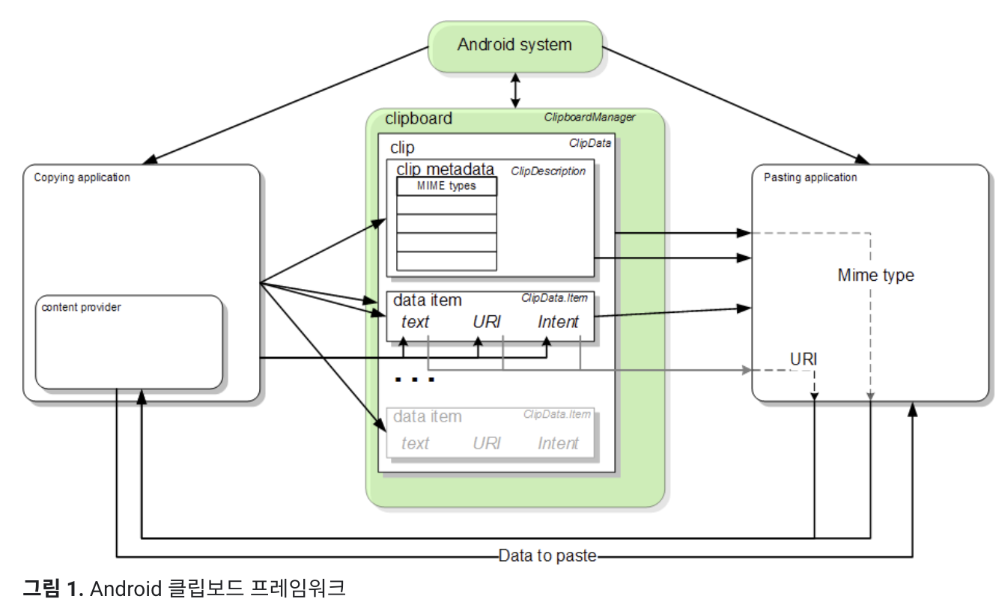

# 2022.03.15

## Clipboard



1. ClipboardManager 클래스의 getSystemService 호출 통해 Clipboard 생성
2. Clipboard안에는 ClipData 존재
    
    → ClipData는 설명(ClipDescription)과 데이터 자체(ClipData.Item) 포함
    

---

## ClipBoard Framework

- 한 번에 클립 객체 하나만 보유
- 클립 객체를 클립보드에 배치할 경우, 이전 클립 객체는 사라짐

### # Text

- 클립보드에서 클립 객체를 가져와서 문자열을 애플리케이션의 저장소에 복사

### # URI

### # Intent

---

## ClipBoard Class

### # ClipboardManager

- android 시스템에서 시스템 클립보드는 전역 `ClipboardManager` 클래스로 표시됨
- getSystemService(CLIPBOARD_SERVICE) 호출 통해 클래스 참조 가져와 사용
    - → `ClipboardManager` 를 직접 인스턴스화 해 사용하는 것이 아님
    

### # **ClipData, ClipData.Item, ClipDescription**

- ClipData
    - 클립보드는 한 번에 ClipData 하나만 보유
    - 데이터 설명과 데이터 자체를 모두 포함하는 객체
        
        → 클립보드에 데이터 추가하기 위해서 2가지 모두 포함해야 함
        
- ClipDescription
    - 클립에 관한 메타데이터 포함
- ClipData.Item
    - Text, URI, Intent 데이터 포함
    - 클립에 객체 2개 이상 추가 가능

### # ClipData Method

- ClipData 객체를 만들기 위한 정적 편의 메서드 제공
    - by ClipData.Item 객체 및 단순한 ClipDescription 객체 사용
    

---

- **newPlainText(label, text)**
    - ClipData.Item 객체에 텍스트 문자열이 포함되는 ClipData 객체 반환
    - ClipDescription 객체의 라벨이 label로 설정
    

### # ClipBoard 데이터를 Text로 강제 변환

- ClipData.Item.coerceToText()
    - 텍스트가 아닌 데이터를 변환하여 클립보드에 복사 가능
    - Charsequence 반환

---

## ClipBoard에 복사

1. 시스템 클립보드 가져오기

```java
// Gets a handle to the clipboard service.
ClipboardManager clipboard = (ClipboardManager)
        getSystemService(Context.CLIPBOARD_SERVICE);
```

1. 새로운 ClipData 객체로 데이터 복사

```java
// Creates a new text clip to put on the clipboard
ClipData clip = ClipData.newPlainText("simple text", "Hello, World!");
```

1. ClipData를 Clipboard에 배치

```java
// Set the clipboard's primary clip.
clipboard.setPrimaryClip(clip);
```

---

## 함수 (Func)

### # 함수 매개변수와 반환 값

1. 반환값이 없는 함수

```swift
func returnFunc() -> String{
    let name: String = "ssooya"
    print(name)
    return name
}

func noReturnFunc(){
    let _ = returnFunc()
    print("end")
}

noReturnFunc()
```

<aside>

    💡  > 반환 값을 가지는 returnFunc()를 호출하고, returnFunc()에서 반환되는 값을 사용하지 않을 경우

    → 변수 타입 선언 뒤에 변수이름을 붙이는 것이 아닌,  `_`  를 사용하면 되며,이때 `_` 는 underscore, 언더바라고 부른다

</aside>

```swift
//noReturnFunc()에서 returnFunc()를 처리하는 다른 방식
func noReturnFunc(){
    returnFunc()
    print("end")
}
```

<aside>

    💡  > 굳이 변수 선언을 하지 않고, 함수이름만 사용하는 식으로 진행도 가능

</aside>

#

1. 여러 개의 반환 값이 있는 함수
- 함수의 반환 타입으로 **튜플 타입** 사용
- 튜플 멤버 이름을 통해 각 데이터에 접근 가능

```swift
func minMax(array:[Int]) -> (min: Int, max: Int){

    var min: Int = array[0]
    var max: Int = array[0]
    
    for data in array[1..<array.count]{
        if(data < min){
            min = data
        }else if(data > max){
            max = data
        }
    }
    return (min, max)
}

let result = minMax(array: [1,2,7,4,0])
print(result.min, result.max) //반환값으로 지정한 라벨로 접근 가능
```

#

2. Optional 튜플 반환 타입
- 함수에서 반환되는 튜플 타입이 값이 없을 가능성(nil인 경우)을 고려

```swift
1. (Int, Int)?    //튜플이 optional

2. (String, Int, Bool)? //튜플이 optional

3. (Int?, Int)    //튜플 말고, 튜플 안 변수가 optional
```

<aside>

    💡  > 1, 2 케이스는 튜플을 optional 타입으로 작성
    → 함수 반환 값으로 nil 전달 가능

    > 3번 케이스는 튜플을 optional 타입으로 작성한 것이 아니라, 튜플에 속하는 변수를 optional로 타입을 지정한 것
    → 함수 전체 반환 값으로 nil 값 전달 불가능

    ❗ 전체 튜플이 optional인지, 튜플 안의 각각의 데이터가 optional 인지 구분

</aside>

#

```swift
func minMax2(array:[Int]) -> (min: Int, max: Int)?{
    
    if(array.isEmpty){  //array가 빈배열일 경우 min, max 변수에 0번째 원소 할당 불가능
        return nil
    }
    
    var min: Int = array[0]
    var max: Int = array[0]
    
    for data in array[1..<array.count]{
        if(data < min){
            min = data
        }else if(data > max){
            max = data
        }
    }
    return (min, max)
}

if let result2 = minMax2(array: [1,4,5,2]){    // 옵셔널 바인딩 통한 함수 반환값 접근 
    print(result2.min, result2.max)
}
```

<aside>

    💡  > array가 빈 배열일 경우, 배열의 0번째 원소로 초기값을 설정하는 코드에서 오류 발생

    → 오류 방지하기 위해서 변수 할당 전, 빈 배열인지 여부 확인
    → 함수의 반환값이 optional 타입이므로, nil값 전달 가능
    → nil을 반환값으로 전달

</aside>

---

### # 함수 Argument Labels & Parameter Names

1. Parameter Names
    - 함수 구현시 사용

```swift
func someFunction(first: Int, second: Int){
    print(first, second)
}
someFunction(first: 1, second: 2)
```

<aside>

    💡  > label 지정되지 않은 경우, 함수 호출시 매개변수 이름과 함께 데이터 넘겨줘야 함

</aside>

#

1. Argument Labels
    - 함수가 호출될 때 사용
    - 라벨 사용을 원치 않을 경우, 생략할 수 있음
        - 라벨 대신 `_` 을 사용하면 됨
    - parameter가 라벨을 가지고 있다면, 함수 호출시 라벨을 반드시 지정해야 함

```swift
func someFunction2(first: Int, from second: Int){   //2번째 매개변수는 label 지정
    print(first, second)
}
//someFunction2(first: 1, second: 2) //error
someFunction2(first: 1, from: 2)    //함수 인자 label 지정했을 경우, label 반드시 사용필요
```

<aside>

    💡  > label이 지정되어 있는 경우, 함추 호출에서 매개변수 이름을 사용하는 것이 아닌 label로 사용해야 함

</aside>

#

```swift
func someFunction3(_ first: Int, _ second: Int){
    print(first, second)
}
someFunction3(1, 2) //label '_'로 선언할 경우, 호출 시 label, 매개변수 이름 등 작성하지 않아도 됨
```

<aside>

    💡 > label을 사용하지 않겠다고 언더바 `_` 를 사용

    → 앞의 예시와 다르게 매개변수 이름 또는 label 이름 사용하지 않고 데이터만 넘겨주면 됨

</aside>

#

1. Parameter에 기본 값 정의
    - if 기본 값 정의, 함수 호출할 때 parameter 생략 가능
    - 일반적으로 기본값이 없는 parameter를 앞에 작성하고, 기본값이 있는 parameter를 뒤에 나열

```swift
func someFunction4(_ first: Int, _ second: Int = 2){    //기본 값 지정된 매개변수가 뒤에 위치
    print(first, second)
}
someFunction4(1)    //second는 기본값 사용
someFunction4(1, 3) //second 기본값 사용하는게 아니라, 새롭게 지정
```

#

1. 가변 parameter
    - 0개 이상의 특정 타입의 값 허용
    - parameter 타입 이름 뒤에 `...` 를 추가하면 됨
    - 가변 parameter에 전달된 값은 함수 내에서 배열로 사용하면 됨

```swift
func someFunction5(_ first: Int, _ second: Int...){ //가변 매개변수도 기본값 정의와 동일하게 뒤에 위치해야 함
    print(first, second)    //'1 [2, 3, 4]' 출력
}
someFunction5(1, 2,3,4)

func someFunction6(_ first: Int..., to second: Int){ //가변 매개변수 뒤에 처음으로 오는 변수는 label 가져야 함
    print(first, second)
}
someFunction6(1, 2,3,4)

func someFunction7(_ first: Int...,  second: Int){    //error
    print(first, second)
}
someFunction7(1, 2,3,4)
```

<aside>

    💡  > someFunction5()
    → 가변 매개변수를 사용할 경우, 매개변수 선언을 뒤에 위치하도록 함

    > someFunction6()
    → 가변 매개변수를 사용할 경우, 가변 매개변수 뒤에 처음으로 위치한 매개변수는 label을 갖도록 해야 함
    → 가변 매개변수와 구분하기 위함

    >  someFunction7()
    → 가변 매개변수가 맨 뒤에 위치하지도, 가변 매개변수 뒤에 위치한 매개변수가 label을 가지지도 않음
    → 오류 발생

    ❗ 가변 매개변수의 위치에 따른, label 필요성 및 생성 여부고려하기

</aside>