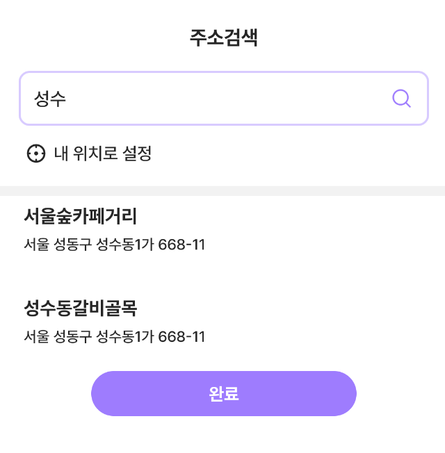
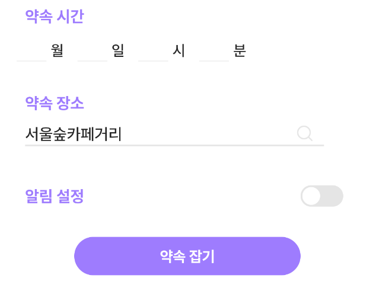
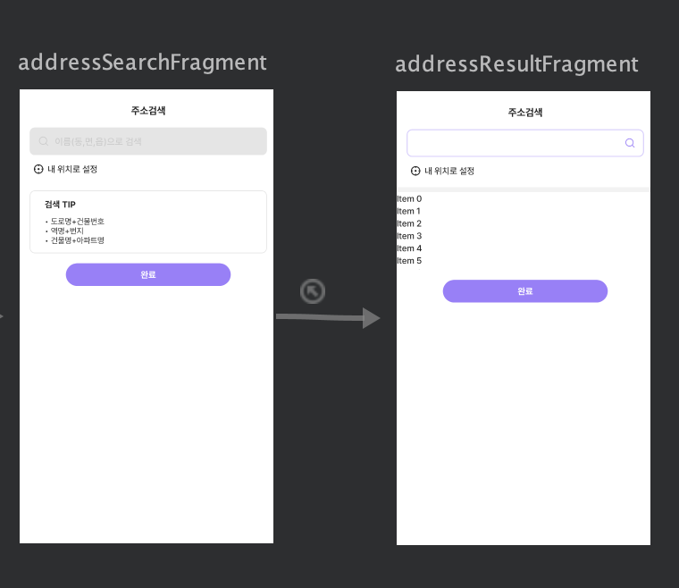
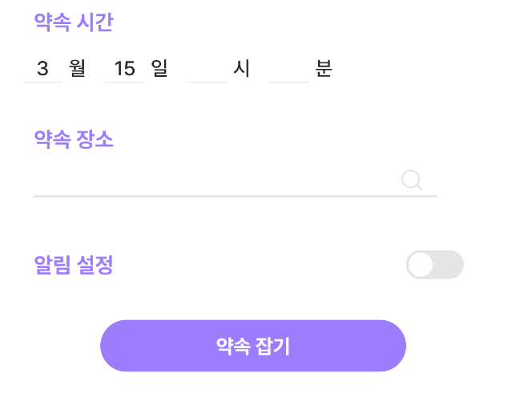
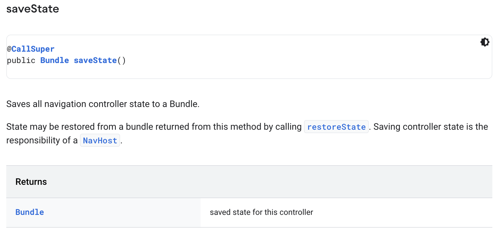
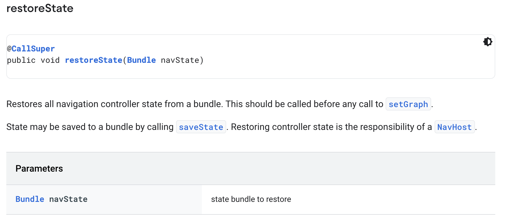
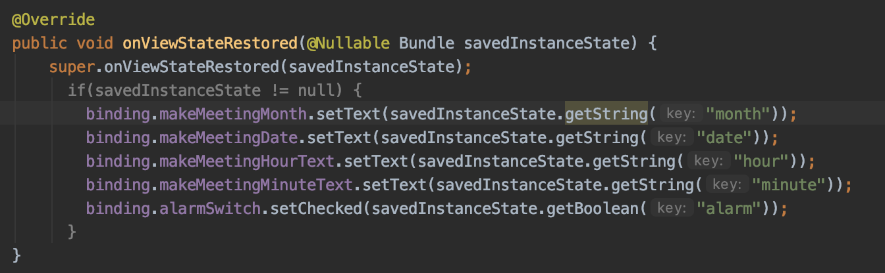
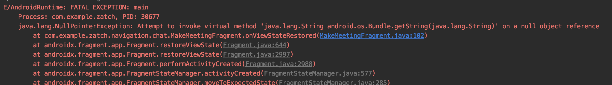
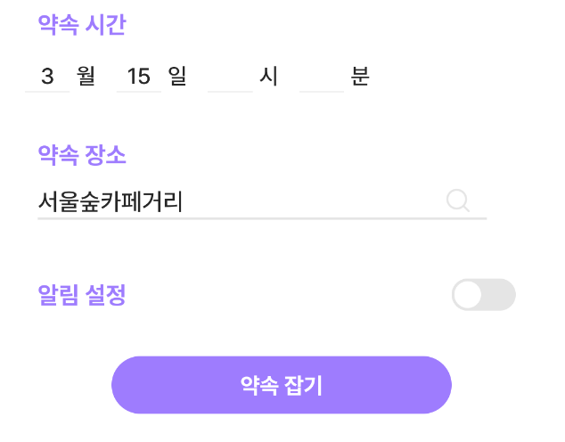

# 2022.03.17

## Fragment 종료 후 결과값 전달 in Navigation

### # ****NavBackStackEntry****

- NavController의 back stack에 있는 entry 지칭

---

### # ****SavedStateHandle****

- ViewModel로 전해진 Handle
    - 실시간 데이터 바인딩 가능 뜻함
- get 또는 getLiveData에 의해 반환되는 LiveData observe 통해 읽을 수 있음
- set 또는 getLiveData에 의해 세팅되는 LiveData observe 통해 작성할 수 있음

- **getLiveData(String key)**
    - key와 관련된 LiveData 반환



왼쪽(AddressResultFragment)에서 특정 장소 선택시, 오른쪽(MakeMeetingFragment)과 같이 해당 fragment 종료 후, 약속 장소에 장소이름이 기입되게 됨

---

```java
//AddressResultFragment
@Override
public void onBindViewHolder(ViewHolder viewHolder, final int position) {
    viewHolder.setData(placeList.get(position));
    viewHolder.itemView.setOnClickListener(v->{
        Navigation.findNavController(getView())
                .getBackStackEntry(R.id.makeMeetingFragment)
                .getSavedStateHandle()
                .set("result",viewHolder.getPlaceName());
        Navigation.findNavController(getView()).popBackStack();
    });
}
```

<aside>

    💡  > getBackStackEntry은 back stack 자체를 가리키는게 아니라, entry 의미

    > backStackEntry 통해 savedStateHandle 가져옴

    → savedStateHandle 통해 LiveData 접근 가능해짐

    → AddressResultFragment 종료 후 MakeMeetingFragment에서

</aside>

---

```java
//MakeMeetingBottomSheet
Navigation.findNavController(getView()).getCurrentBackStackEntry().getSavedStateHandle()
                .getLiveData("result").observe(getViewLifecycleOwner(), o -> {
            onViewStateRestored(bundle);
            binding.meetingPlace.setText(o.toString());
}
```

<aside>

    💡  > MakeMeetingBottomSheet에 설정한 savedStateHandle을 사용하기 위해서는 MakeMeetingBottomSheet의 viewCreated 메서드에 currentBackStackEntry를 통해 LiveData를 가져오며, observe/get 코드를 추가하면 됨

</aside>

---

<aside>

    ❗ BackStackEntry를 통해 Navigation Fragment의 결과값을 이전 Fragment에 전달할 수 있다!

</aside>

추가로,

```java
<fragment
        android:id="@+id/addressSearchFragment"
        android:name="com.example.zatch.navigation.chat.AddressSearchFragment"
        android:label="AddressSearchFragment"
        tools:layout="@layout/fragment_find_place_search">
        <action
            android:id="@+id/action_addressSearchFragment_to_addressResultFragment"
            app:destination="@id/addressResultFragment"
            app:popUpTo="@id/makeMeetingFragment"
            app:popUpToInclusive="false"/>
    </fragment>
```

<aside>

    ❗  > A에서 B로 이동할 때, B에서 pop 이후 도착지 설정은 A→B action에서 설정해주면 됨 

    → 이때 popUpTo로 설정하며, A전에 C가 존재하고, B에서 C로 돌아간다면 popUpTo 설정 필수

    → if 설정X, AddressResultFragment 종료 후 MakeMeetingFragment으로 가는게 아니라 AddressSearchFragment로 가게됨

</aside>



원에 둘러싸인 화살표가 popUpTo를 의미..?하는 듯 하다

@ 참고

[https://jaeyeong951.medium.com/navigation-component의-결과값-전달하기-c10e795d6858](https://jaeyeong951.medium.com/navigation-component%EC%9D%98-%EA%B2%B0%EA%B3%BC%EA%B0%92-%EC%A0%84%EB%8B%AC%ED%95%98%EA%B8%B0-c10e795d6858)

---

## Fragment state Save and Restore

<aside>

    💥 BottomSheet 약속 잡기 Fragment에서 약속 시간을 미리 세팅해두고, 이후 약속 장소를 선택할 경우 약속 시간 데이터가 초기화되는 문제 발생

    → 약속 장소를 설정할 때는 navigation에 의해 기존 fragment가 다른 fragment로 전환되는 상황

    ⇒ 기존 데이터 값 유지되도록 해야함

</aside>

!

왼쪽상태였다가, 장소 선택 이후 오른쪽으로 됨(약속 시간 정보 사라지는 현상)

---

<aside>

    💡 **문제 해결 과정**

    → 화면 전환이 일어날 때마다 새롭게 fragment를 생성하는 navigation 때문에 발생하는 문제점이기 때문에 navigation 문서에서 해결방안을 찾으려고 해봄

    → 문서에서 state와 관련된 메서드 발견
    (처음 발견했을 때는 navcontroller의 state를 저장하는 건줄 몰랐음.. fragment의 view 데이터 저장에 정신이 팔려서 당연히 이 부분을 해결해줄거라고 생각했었음)

    → saveState, restoreState 활용 방법 고민하면서 다른 문서들 찾아보다가 onViewStateRestored와 onSaveInstanceState 메서드 발견

    → 코드 구현

    → 해결!

</aside>





- **onSaveInstanceState(Bundle outState)**
    1. Activity
    - onCreate 또는 onRestoreInstanceState에서 상태를 복원할 수 있도록 kill 되기 전에 호출됨
    - 나중에 돌아왔을 때, state를 회복할 수 있도록 하기 위해서 호출되는 메서드
    - if A 위로 B가 실행될 예정, A는 나중에 자신이 다시 실행될 상황을 대비해 state를 저장해놓음
    
    1. Fragment
    - 새로운 인스턴스에서 재구성될 수 있도록, 현재 상태를 저장하도록 요청하기 위해 호출
    - 후에 새로운 인스턴스가 생성되고, onCreate, onCreateView, onActivityCreated에서 이용 가능
    - onDestroy 전에 아무때나 호출 가능
    
- **onViewStateRestored (Bundle savedInstanceState)**
    - Fragment method
    - 저장된 모든 상태가 fragment의 view 계층으로 복원되면 호출됨
    - 저장된 상태로 초기화하는데 사용됨

<aside>

    ❗ 위의 함수 호출하기만 한다고 알아서 해주는게 아니다.. 필요한 부분들 저장하고 복구 시키는건 나의 몫..

</aside>

---

```java
binding.meetingPlace.setOnClickListener(v->{
            onSaveInstanceState(bundle);
            Navigation.findNavController(getView()).navigate(R.id.action_makeMeetingFragment_to_addressSearchFragment);        
});       
```

<aside>

    💡  > meetingPlace는 주소 검색 버튼으로, 해당 버튼을 누를 경우 다른 fragment로 대체되게 됨

    → view가 사라지기 전(navigate 발생하기 전)에 onSaveInstanceState 메서드 호출 통해 기존 상태 저장

</aside>

---

```java
Navigation.findNavController(getView()).getCurrentBackStackEntry().getSavedStateHandle()
                .getLiveData("result").observe(getViewLifecycleOwner(), o -> {
            onViewStateRestored(bundle);
            binding.meetingPlace.setText(o.toString());
```

<aside>

    💡  > 주소 검색 fragment로 전환되어 있다가, 해당 fragment 종료 후 다시 돌아올 때 onViewStateRestored를 호출해 기존 상태로 복구시키는 코드

</aside>

---

```java
@Override
    public void onSaveInstanceState(@NonNull Bundle outState) {
        super.onSaveInstanceState(outState);
        outState.putString("month",binding.makeMeetingMonth.getText().toString());
        outState.putString("date",binding.makeMeetingDate.getText().toString());
        outState.putString("hour",binding.makeMeetingHourText.getText().toString());
        outState.putString("minute",binding.makeMeetingMinuteText.getText().toString());
        outState.putBoolean("alarm",binding.alarmSwitch.isChecked());
    }

    @Override
    public void onViewStateRestored(@Nullable Bundle savedInstanceState) {
        super.onViewStateRestored(savedInstanceState);
        if(savedInstanceState != null) {
            binding.makeMeetingMonth.setText(savedInstanceState.getString("month"));
            binding.makeMeetingDate.setText(savedInstanceState.getString("date"));
            binding.makeMeetingHourText.setText(savedInstanceState.getString("hour"));
            binding.makeMeetingMinuteText.setText(savedInstanceState.getString("minute"));
            binding.alarmSwitch.setChecked(savedInstanceState.getBoolean("alarm"));
        }
    }
```

<aside>

    💡  > onViewStateRestored와 onSaveInstanceState는 Fragment에서 제공하는 메서드로 Fragment 내에서 자유롭게 호출하고, 필요할 경우 override해 코드를 추가해 동작을 추가하면 됨

</aside>

---

<aside>

    💥 onViewStateRestored에서 NullPointerException 문제 발생

</aside>





<aside>

    💡  > onViewStateRestored는 onActivityCreated 와 onStart 사이에서 실행되기 때문에, null 값 발생할 수 밖에 없음

    → 기존 fragment 상태 저장이 onStart 이후인 onResume 단계에서 사용자의 상호작용을 통해 이뤄지기 때문

    → onSaveInstanceState를 호출하기 전까지는 null 값 상태

    ⇒ null 값 검사를 통해 null이 아닐 때만(state 저장된 상태) 기존 상태 복구 작업 되도록 코드 수정

</aside>

---



문제 해결!