# 2022.03.21

## RecyclerView 높이 설정 in BottomSheet

<aside>

    💥 BottomSheet에서 RecyclerView를 사용할 때, xml 파일에서 wrap_content로 높이 지정할 때 위에 위치한 다른 view들을 덮는 현상 발생 (추가로 RecyclerView가 잘리는 현상도 있었음)

    → RecyclerView에 binding 하는 item 개수가 많아지고, 이로 인해 예상한 크기보다 커지면서 constraint layout 제약을 추가했음에도 영역 침범하는 것

    → view가 전체 화면으로 생성될 경우는 제약조건 설정과 높이값을 0dp로 설정해 해결이 가능한 부분이지만, BottomSheet은 상황이 다름

    → 처음 BottomSheet view가 생성될 때 전체 view가 보이는 것이 아니기 때문

</aside>

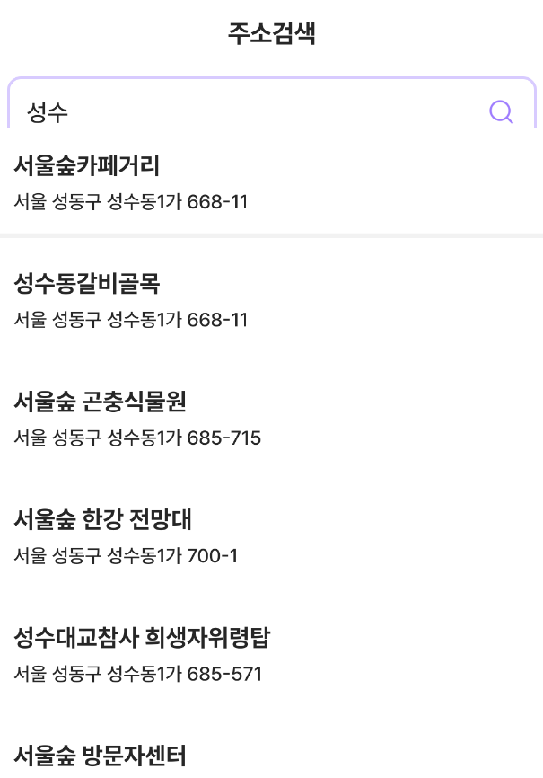

---

💡  **문제 해결 위한 생각 복기**

RecyclerView의 높이 설정을 wrap_content, match_parent, 0dp 모두 불가능하기 때문에 코드로 직접 높이값 지정으로 해결해야겠다고 생각

→ RecyclerView의 높이를 특정 값으로 지정하는 것도 방법이 될 수 있지만, 같은 px값이라도 기기마다 디스플레이 크기가 다르기 때문에 좀더 안전한 방법으로 남는 높이 전체를 RecyclerView에 할당하도록 했다

```java
int recyclerviewHeight = height - binding.c0.getHeight() - navigationHeight;                
binding.addressRecyclerview.getLayoutParams().height = recyclerviewHeight;
```

<aside>

    💡 > 여기서 c0는 RecyclerView를 제외한 다른 view들을 하나의 Constraint Layout으로 묶은 것

    → 전체 디스플레이 높이에 대해서 c0값을 제외한 전체를 RecyclerView에 할당해 0dp와 같은 기능을 하도록 함

</aside>

왼쪽은 RecyclerView item을 맨 위로 올렸을 때 상태로, 위의 view를 덮는 현상 해결

오른쪽은 RecyclerView item을 맨 아래로 내렸을 때 상태로, 마찬가지로 item 잘리는 현상 해결

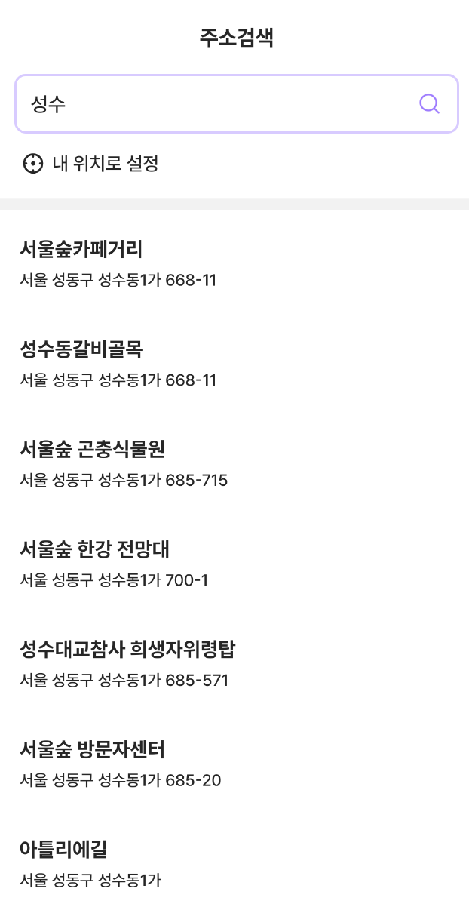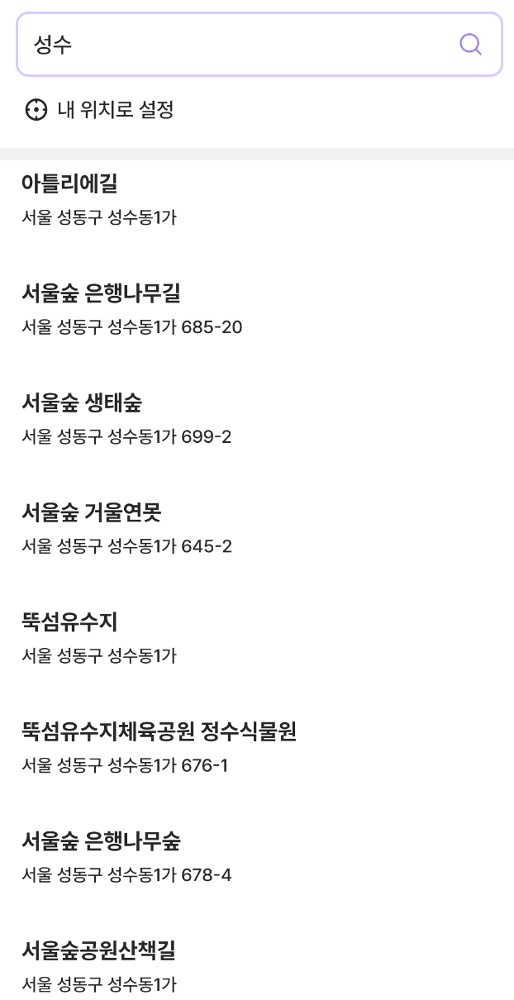


## AutoLayout Guide

AutoLayout은 뷰 계층에 있는 모든 뷰에 대해서 동적으로 사이즈와 위치를 계산

→ 뷰의 제약조건을 기반으로 계산이 진행됨

### AutoLayout Without Constraints

    **= Stack View**

: 사용자 인터페이스 뒤에서 AutoLayout을 단순화하는 high-level 추상화를 설명

- Stack view는 제약의 복잡성을 초래하지 않고 Auto Layout을 쉽게 활용할 수 있도록 해줌
- 객체가 본래 content사이즈를 가지고 있다면, 그 사이즈대로 stack에 드러나게 됨
    
    → 본래 content 사이즈가 없는 경우, default 사이즈로 설정되며, resize도 가능
    
- stack view 안에 또다른 stack view를 넣을 수도 있음
    
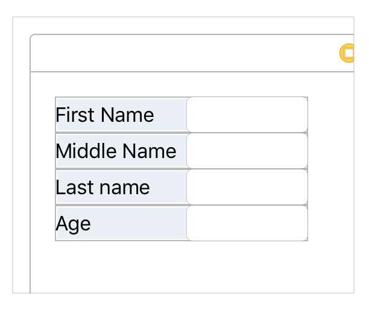
    
- stack view안의 item끼리 margin 값 적용시킬 때는 **spacing** 속성 값 이용
    
    → constraint 적용 안됨
    
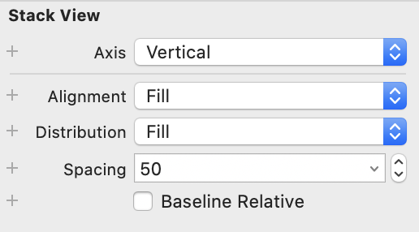
    

---

### + Stack View Test

Apple 공식 문서에서 제공하고 있는 예제이다. 

@ 참고

[https://developer.apple.com/library/archive/documentation/UserExperience/Conceptual/AutolayoutPG/LayoutUsingStackViews.html#//apple_ref/doc/uid/TP40010853-CH11-SW1](https://developer.apple.com/library/archive/documentation/UserExperience/Conceptual/AutolayoutPG/LayoutUsingStackViews.html#//apple_ref/doc/uid/TP40010853-CH11-SW1)

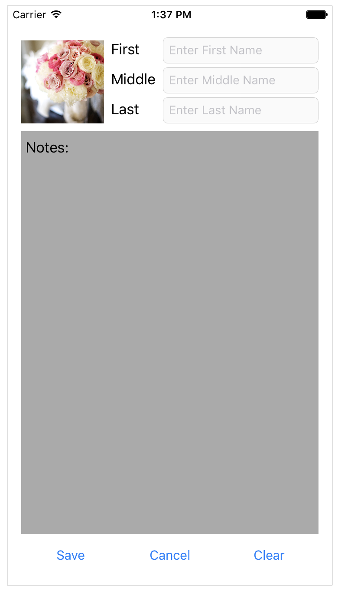

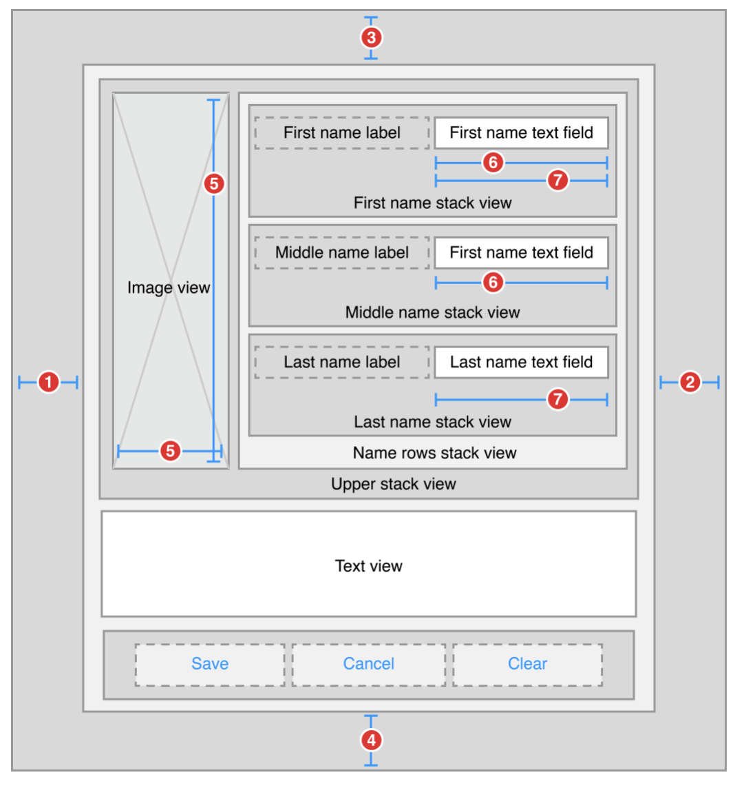

<aside>

    💡  > 아래 오른쪽 사진이 왼쪽 사진에 대한 뷰 계층 설계도

    → 앞으로 view에 UI 배치할 때 stack view를 적극 활용하면 될 듯 싶다

</aside>

---

<aside>

    💥  왼쪽 사진과 같이 text field의 크기가 모두 동일해야 함. 

    하지만 오른쪽 사진을 보면 알 수 있듯이, 현재 text field 옆 label의 사이즈가 다르기 때문에 text field의 width 값 조절이 필요함

    → 서로 다른 상황에 놓인 text field의 크기를 동일하게 설정해야 하는 문제 발생

</aside>

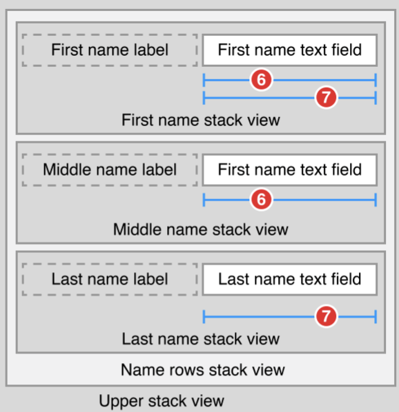

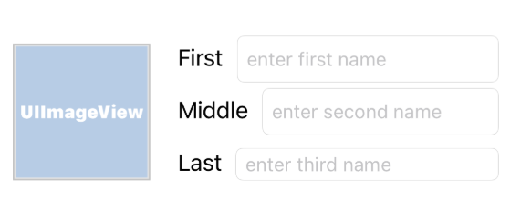


<aside>

    💡  > text field를 하나 선택하고 optipn키를 사용해 다른 text field에 드래그 하면 이렇게 여러 설정값들을 ui에 설정할 수 있다. 

    → text field끼리 width 값을 동일하게 맞춰주는 것이 목표이기에 equl widths 선택

</aside>

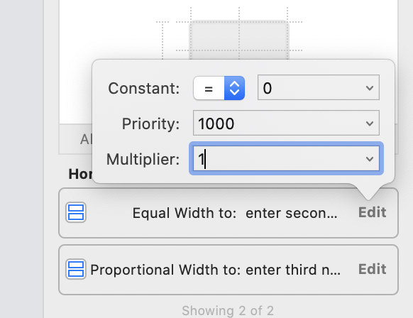

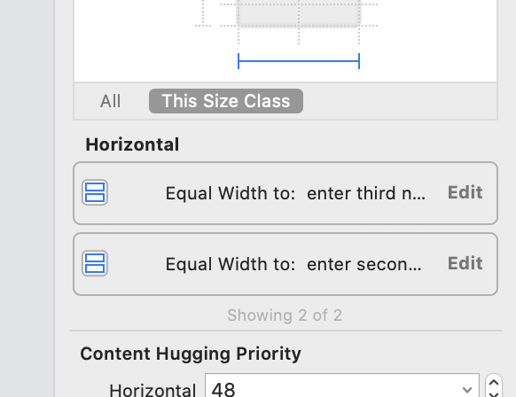

<aside>

    💥 equal width를 맞춰도 width 길이가 맞춰지지 않는 문제가 있었다.

</aside>

<aside>

    💡 > text field의 설정 값을 보니, equal width to가 아니라 propotional width to 상태

    → multiplier가 0.9 또는 1.0x 값이라서 width가 동일하게 적용되지 않았던 것이다

    ⇒ multiplier 속성 1로 설정

</aside>

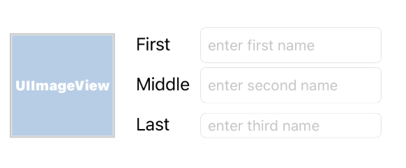

완성! 

---

### Anatomy of a Constraint

- 뷰 계층의 일련의 선형 방정식으로 정의됨
- 각각의 제약은 하나의 방정식을 나타냄
    - Blue: 제약조건 기준, Red: 제약조건 대상
    - multiplier : 제약조건 기준 값의 배율이라 생각
    - constant : 원하는 제약조건 값

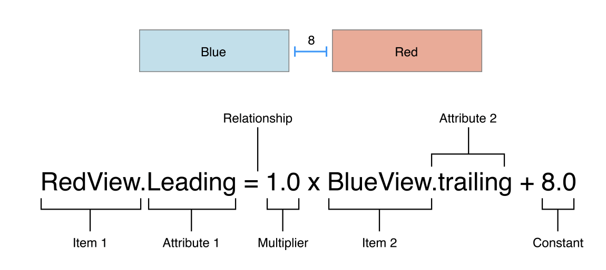

1. 왼쪽 경계(leading edge)에 대한 margin 값과 item의 width가 고정된 상태
    
    → 오른쪽 경계(trailing edge)에 대해서는 부모 view의 사이즈와 다른 제약조건에 의해서 계산
    
    → 💥 디바이스 크기가 변경되더라도 item의 width가 디바이스 크기에 맞춰 변경되지 않는 문제점
    
    ⇒ width 크기 고정시키면 안됨
    

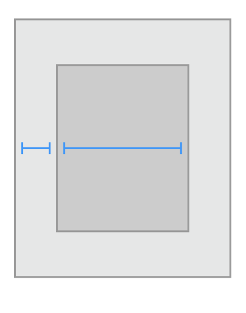

1. leading edge와 trailing edge 제약조건 설정
    
    → item의 width가 계산되어 적용
    

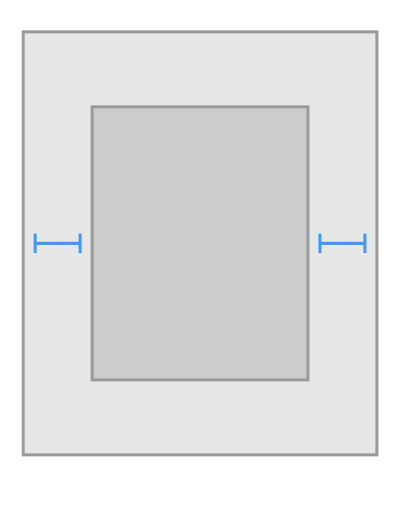

1. leading edge 설정 및 super view의 정중앙에 위치(가로에 대해서)
    
    → width와 trailing edge가 계산되어 적용
    

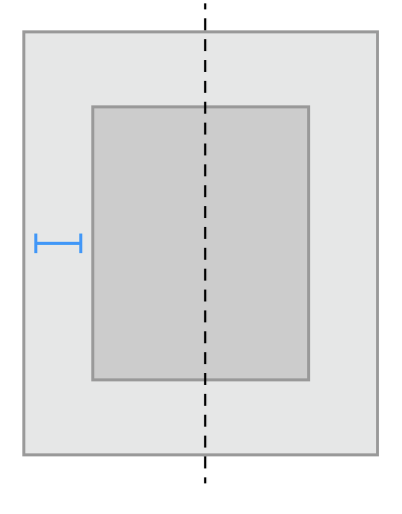

<aside>

    💡  > 세로축을 기준으로, 가운데 정렬하고 싶을 때 유용하게 사용하면 됨

</aside>

---

<aside>

    ❗ 2,3 번은 동일한 행동을 유발
    but 반드시 같은 결과를 도출하는 것은 아니라고 한다(?)

    추가로, 3번이 더 유용하다고 함
    → 여러 항목을 중앙에 정렬할 때 사용하라고 문서에 적혀있으니 참고!

</aside>

- Intrinsic Content Size
    - view의 현재 content를 기반으로 사이즈 결정

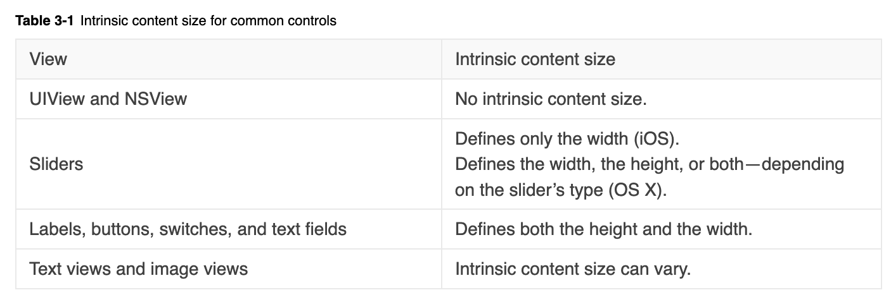

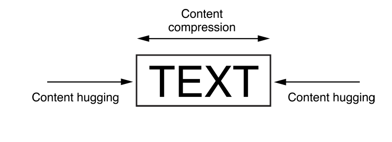

<aside>
    
    👉🏻 view의 intrinsic content size는 각 차원의 제약조건을 사용해 결정됨
    
    → view를 안쪽으로 미는 content hugging 정도와 밖으로 밀기위해 저항하는 정도인 content compression에 의해 결정

</aside>

---
