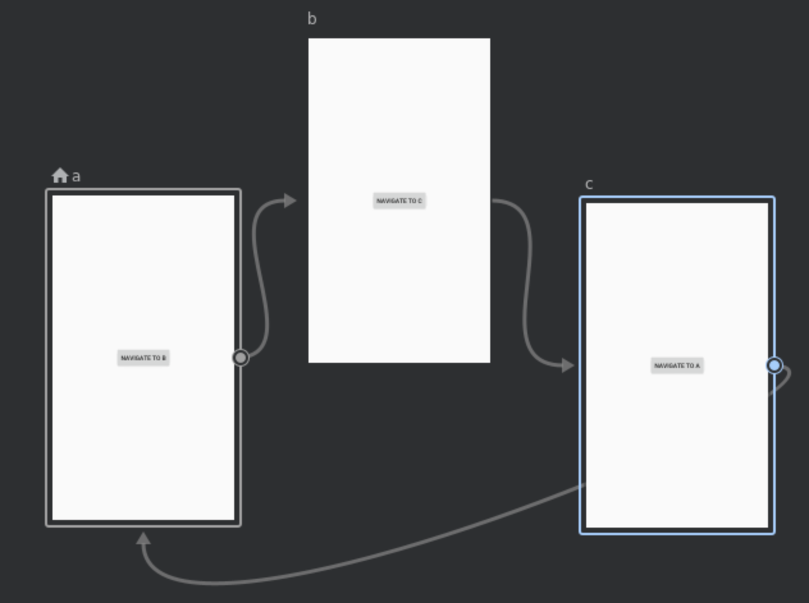
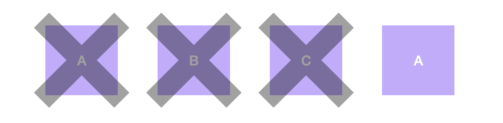
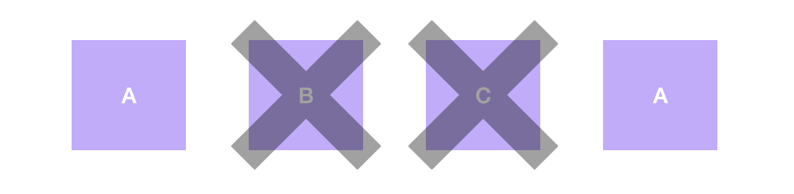
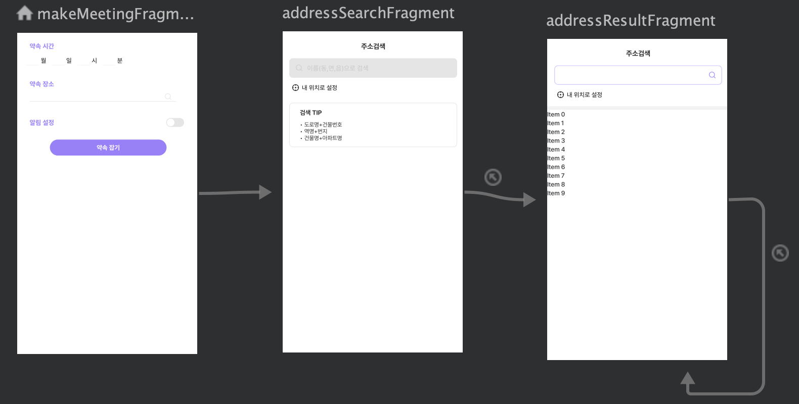
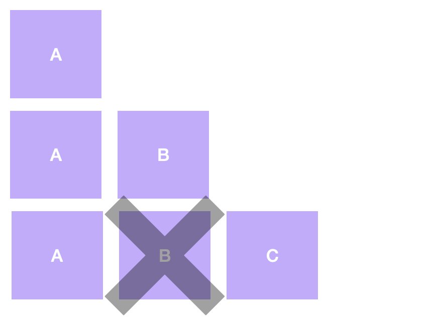
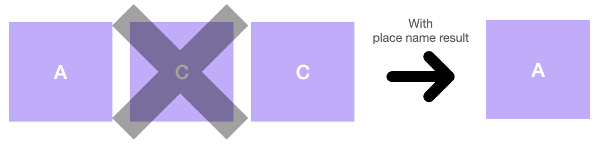

# Navigation

## popUpTo 및 popUpToInclusive

- 사용자가 로그인 했을 때, 사용자가 뒤로 버튼을 눌러도 로그인 흐름으로 돌아가지 않도록 로그인과 관련된 모든 대상을 백 스택에서 팝해야 하는 상황 등에서 사용하면 된다

### 순환 로직 예시

<aside>

    👉🏻  A → B → C → A 의 순환 로직 상황

</aside>



1. popUpTo = A, popUpInclusive = true
    
    
    

<aside>

    💡  > popUpInclusive 값이 true이기 때문에, popUpTo 대상인 A가 stack에 이미 존재할 경우, 다른 item들과 같이 A도 pop

    ⇒ stack에 A가 1개 존재하게 됨

</aside>

1. popUpTo = A, popUpInclusive = false



<aside>

    💡  > popUpInclusive 값이 false이기 때문에, popUpTo 대상인 A가 stack에 이미 존재하더라도, pop되지 않음

    ⇒ stack에 A가 2개 존재하게 됨

</aside>

---

### 순환 로직 응용 상황

<aside>

    👉🏻  A : 약속 잡기 메인 Fragment
    B : 약속 장소 검색어 입력 Fragment
    C : 약속 장소 검색 결과 Fragment

    1. 기본적으로 A → B → C 순서
    2. C에서 장소 선택 완료할 경우, pop 통해 A로 결과값과 함께 돌아옴
    3. C에서 edit text에 새로운 검색어를 입력할 경우, 새로운 C를 생성하며 기존 C 제거

    위의 세가지 조건을 만족해야 한다

</aside>



현재 구상한 로직은 아래와 같다

- A → B → C 이동 과정



<aside>

    💡  > B → C 이동시, B를 stack에서 제거하기 위해 B → C action에 popUpTo 기능 사용

</aside>

```xml
<fragment
        android:id="@+id/B"
        <action
            android:id="@+id/actionBToC"
            app:destination="@id/C"
            app:popUpTo="@id/A"
            app:popUpToInclusive="false"/>
</fragment>
```

- C → A 이동과정, 케이스가 2가지로 나뉨
    - 여기서 유의사항은 위의 예시와 다르게 C → A로 navigate 하는게 아니라, pop으로 이동
    (A에서 사용자가 입력한 기존 데이터 유지하기 위해서)
    
    ```xml
    <fragment
            android:id="@+id/C">
            <action
                android:id="@+id/C_Self"
                app:destination="@id/C"
                app:popUpToInclusive="true"
                app:popUpTo="@id/C"/>    
    </fragment>
    ```
    
    1. C에서 재검색 하지 않고, 바로 장소 선택 완료한 경우
        
        
        
        ```java
        Navigation.findNavController(getView()).popBackStack();
        ```
        
        <aside>
        
            💡  > navigaton xml 파일에서 stack 제거 설정을 모두 완료했기 때문에, 코드로 popBackStack()만 실행시키면 A로 돌아가게 된다
        
        </aside>
        
    2. C에서 재검색 과정을 거친 후, 장소 선택 완료한 경우
        
        

        ```java
        Bundle bundle = new Bundle();                    
        bundle.putString("searchPlace", newPlace);                    
        Navigation.findNavController(view).navigate(R.id.action_addressResultFragment_self, bundle);
        ```
        
        <aside>
        
            💡  > 위의 코드로 새로운 검색 결과 전달받고, 이후 장소 선택 완료했을 경우 1번에서 사용한 코드로 A로 돌아가게 된다
        
        </aside>